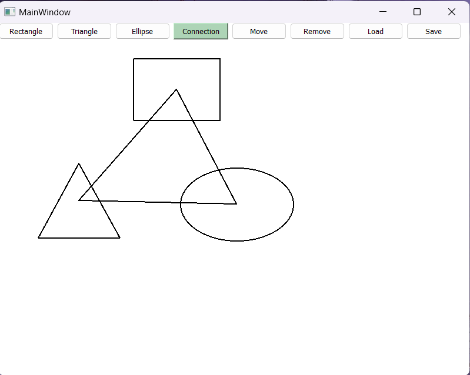

# Qt Painter project

___OVERVIEW___
>The project was written without using QGraphicsItem!

Actions:
+ Rectangle, Triangle, Ellipse – when any of these buttons are activated, the next left mouse click in the workspace
starts drawing the corresponding shape. 
The upper left point of the shape is the mouse click point, the lower right is the current mouse coordinates
(the ellipse and triangle fit into the rectangle with these coordinates).
When you release the left mouse button, the drawing of the shape is completed, it is added to the workspace. 
If the right mouse button or Esc button was pressed before releasing the left button, drawing is interrupted and the shape is not added 
to the workspace.
+ Link – when this button is activated, clicking on any shape in the workspace starts drawing a link (line) from the center of this shape
to the current coordinates of the cursor. When you click on another shape again, 
a link between the first and second shapes is added to the workspace. 
If the repeated click was made not on the figure, or on the initial figure, 
the drawing of the connection is interrupted. Drawing is also interrupted when you right-click or press Esc.
+ Move - when this button is activated, pressing the left button on any shape in the workspace causes the cursor to change to "hand".
When you move the mouse pointer, the shape also moves. If a shape has connections to other shapes, these connections must also move. 
When you release the left mouse button, the movement of the shape is completed. The movement is interrupted when the right mouse button
is pressed or Esc is pressed. 
+ Delete - When activating this button, clicking on any shape in the workspace causes it to be deleted,
along with all its connections. 
+ Upload, Save – upload and save a picture to a txt.file. 
After loading, it is possible to continue drawing (adding, moving, deleting, etc.) shapes.

___BUILDING AND RUNNING THE APP___

Build the project using the following 4-line script:

+ mkdir build
+ cd build
+ cmake ..
+ cmake --build .

Then for running the app:
+ cd Debug
+ sample-app.exe

***
___SCREENSHOTS___

***
___VIDEO_PREVIEW___

